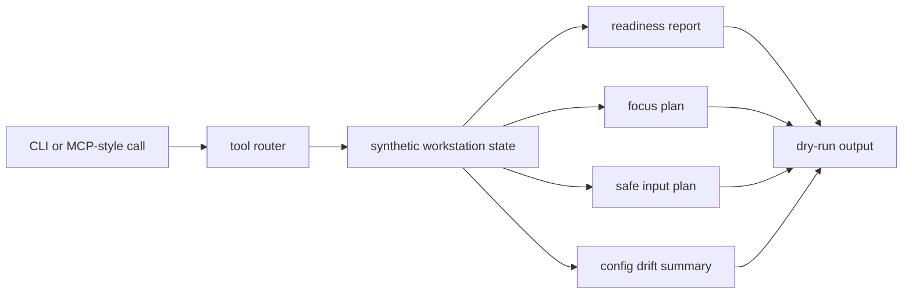

# Portfolio Proof Notes

This page gives reviewers a fast path through the public-safe workstation automation patterns in `open-workstation-mcp`.

## What This Proves

- Local automation can be represented as dry-run plans without touching the live desktop.
- Workstation readiness, focus planning, input planning, and config drift can be demonstrated from synthetic state.
- A public sample can discuss Linux/Wayland automation without publishing private dotfiles, screenshots, account data, or browser profiles.
- Response budgeting and explicit parameters make local automation safer for AI tool use.

## Architecture Diagram



## Five-Minute Reviewer Path

```bash
git clone https://github.com/hairglasses/open-workstation-mcp.git
cd open-workstation-mcp
make ci
go run ./cmd/open-workstation-mcp call workstation_status --param profile=desktop
go run ./cmd/open-workstation-mcp call safe_input_plan --param target=search --param text=hello
```

Then inspect `docs/EXAMPLES.md`, `docs/ARCHITECTURE.md`, and `PUBLIC_BOUNDARY.md`.

## Walkthrough Or Demo Plan

1. Show the manifest to introduce the available workstation tools.
2. Run `workstation_status` against the synthetic desktop profile.
3. Run `window_focus_plan` to show a dry-run focus decision.
4. Run `config_drift_report` to show reviewable drift output.
5. Run `safe_input_plan` and emphasize that it does not type into a live UI.

## Trust Boundary

Included public state: synthetic readiness data, synthetic app names, dry-run focus plans, dry-run input plans, and generic config drift examples.

Excluded private state: hostnames, dotfiles, screenshots, live window titles, browser profiles, cookies, account identifiers, secrets, local paths, and private workstation automation code.

## Tradeoffs

- The repo proves the automation shape but never touches the real desktop. That is safer for public review and easier to test.
- Synthetic drift examples are less comprehensive than a live dotfiles audit, but they preserve the public/private boundary.
- The dry-run-first design makes tool results reviewable before any future executor could act.

## Interview Deep-Dive Prompts

- What should a local automation tool prove before it is allowed to type or click?
- How would you represent live window state without leaking private app titles or account data?
- Which workstation actions should always require human approval, even if the model is confident?
